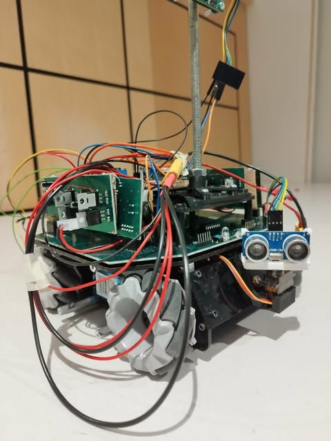
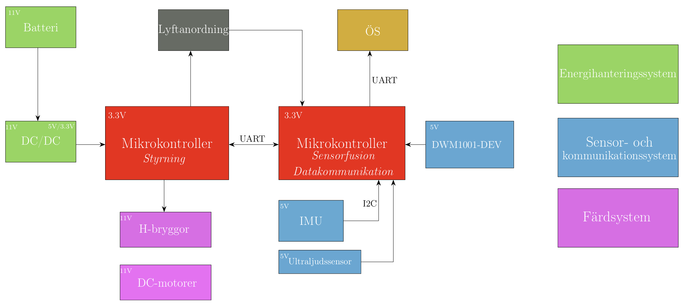
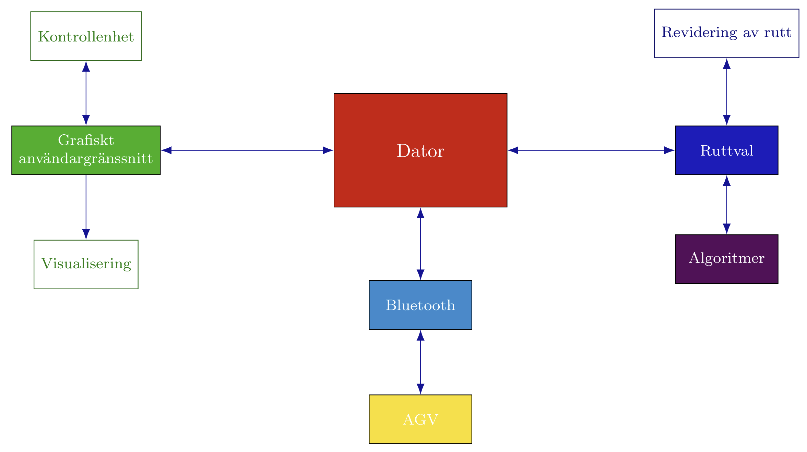

# BSc Thesis – AGV Autonomous Parking

Bachelor thesis project focused on developing an autonomous parking system prototype 
using an **Automated Guided Vehicle (AGV)** and a **Supervisory System (ÖS)**.

Developed in collaboration with **Autopark AB**.

<p align="center">
  
</p>

<p align="center">
  <i>AGV prototype used for autonomous parking demonstrations</i>
</p>

---

## Overview

This project explores a cost-effective autonomous parking solution for **non-self-parking vehicles**.

The concept is based on an **AGV capable of towing vehicles** by lifting the front axle and transporting 
them to available parking spaces inside a parking garage. The system combines autonomous navigation
with a supervisory control system that handles route planning, parking allocation, and real-time monitoring.

The project demonstrates an integrated interaction between:

- **AGV (Automated Guided Vehicle)** — responsible for physical navigation and vehicle transportation
- **Supervisory System (ÖS)** — responsible for logistics, planning, and visualization

Communication between the AGV and the supervisory system is handled wirelessly via **Bluetooth**.

---

## Project Objective

The objective is to develop a fully functional prototype where the AGV:

1. Retrieves a vehicle from the parking entrance  
2. Selects the optimal parking location  
3. Navigates autonomously to the parking spot  
4. Parks the vehicle  
5. Returns to the entrance  

The complete cycle should be repeatable **at least five times within ten minutes**, 
coordinated through instructions from the supervisory system.

---

## System Architecture

### AGV Subsystem

The AGV is responsible for:

- Autonomous navigation
- Vehicle transport
- Obstacle avoidance
- Parking execution
- Wireless communication with the supervisory system

The AGV software is developed using **PlatformIO** and runs on an embedded microcontroller architecture.

<p align="center">
  
</p>

### Supervisory System (ÖS)

The supervisory system is responsible for:

- Parking space selection
- Route optimization
- Real-time AGV tracking
- GUI visualization
- Task coordination

The supervisory system is developed in **Java**.

<p align="center">
  
</p>

---

## Repository Structure

```text
.
├── AGV/
│   ├── AGV CODE/          # PlatformIO embedded software
│   ├── common/            # Shared resources
│   ├── DCDC/              # Power electronics
│   ├── Hbrygga/           # H-bridge hardware
│   └── Moderkort/         # Main control board
│
├── ÖS/
│   ├── Bluetooth/         # Wireless communication
│   └── GUI/               # Supervisory system interface
│
├── docs/
│   └── images/
│       ├── agv-prototype.png
│       ├── agv-system-diagram.png
│       └── supervisory-system-diagram.png
│
└── TODO.md
```

---

## Technologies

### AGV
- PlatformIO
- Embedded C/C++
- Bluetooth Communication
- Autonomous Navigation
- Sensor Fusion
- Kalman Filtering

### Supervisory System (ÖS)
- Java
- GUI Development
- Route Planning
- Real-Time Monitoring

---

## Authors

- André Olsson  
- Daniel Santana Wettermark  
- Esaias Ernfridsson  
- Fredrik Bergström  
- Hanna Boiardt  
- Maximilian Hallqvist  
- Maria Wallbom

---

## Project Type

Bachelor Thesis Project in Electrical Engineering [ED] / Kommunikation, transport och samhälle [KTS]
